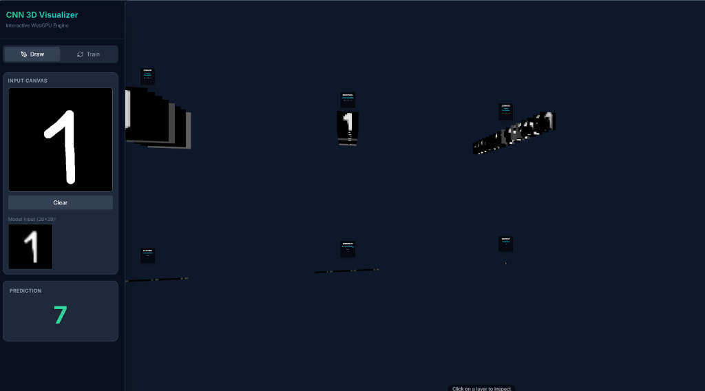

# 🧠 3D CNN Explainer

A high-end, interactive web application that helps you **visualize Convolutional Neural Network (CNN) operations** in 3D. This project allows you to "see through" what the computer actually sees when recognizing handwritten digits.

🔗 **Live Demo:** [Experience it here](https://NotIsora.github.io/cnn-3d-viz/)



## ✨ Key Features

### 1. 🖌️ Real-time Interaction
-   **Freehand Drawing**: Draw digits on the canvas, and the system recognizes them instantly.
-   **Real-time Inference**: The AI model runs directly in the browser using **TensorFlow.js** (WebGPU/WebGL), with no image data sent to a server.

### 2. 🧊 Fluid 3D Visualization
-   **True Feature Maps**: Instead of abstract cubes, the system displays **actual images (2D Textures)** that the neural network is "learning" at each layer.
    -   *Layer 1 (Conv2D)*: Clearly shows edges, curves, and simple features.
    -   *Layer 2 (MaxPooling)*: Shows condensation of features.
-   **Fluid Animations**: Neural layers transform smoothly (Interpolation) as you draw new strokes.
-   **Interactive Inspection**:
    -   **Click to Zoom**: Click on any layer to have the camera automatically zoom in and focus on it.
    -   **Detailed Explanations**: A detailed info panel appears, explaining the mechanism, simplified mathematical formulas, and the significance of that layer (e.g., "Feature Extraction", "Downsampling").
-   **Optimized Layout**: A 2-row grid layout makes it easier to observe the entire network.

### 3. 🧠 Optimized AI Model
-   **Architecture**: Conv2D -> MaxPooling -> Conv2D -> Flatten -> Dropout -> Dense.
-   **Robustness**: Trained with **Data Augmentation** (rotation, shift) and **Regularization** (Dropout, L2) to robustly recognize distorted or off-center handwritten digits.

## 🛠 Core Technologies

-   **Frontend**: [Next.js 14](https://nextjs.org/) (App Router, TypeScript)
-   **3D Graphics**: [Three.js](https://threejs.org/) & [React Three Fiber](https://docs.pmnd.rs/react-three-fiber)
    -   *Custom Shaders/Textures* for high performance.
-   **AI Core**: [TensorFlow.js](https://www.tensorflow.org/js)
-   **Styling**: Tailwind CSS & Lucide Icons

## 📂 Project Structure

```bash
src/
├── app/                  # Next.js Pages
├── components/
│   ├── scene/            # 3D Components
│   │   ├── NetworkView.tsx   # 3D Scene Manager
│   │   └── LayerMesh.tsx     # Render Feature Maps (DataTexture)
│   └── ui/               # 2D Interface (Button, Drawing Canvas)
├── core/                 # AI & Logic
│   ├── CNNEngine.ts      # Model & training loop management
│   └── MnistData.ts      # MNIST data processing
└── styles/               # Global CSS
```

## 🚀 Installation & Setup

1.  **Clone the repo:**
    ```bash
    git clone https://github.com/NotIsora/cnn-3d-viz.git
    cd cnn-3d-viz
    ```

2.  **Install dependencies:**
    ```bash
    npm install
    # or
    yarn install
    ```

3.  **Run development server:**
    ```bash
    npm run dev
    ```
    Open `http://localhost:3000`.

## 🤝 Contribution

This project is open source. All contributions (Pull Request, Issue) are welcome!

---
*Developed with ❤️ using Next.js & TensorFlow.js*
